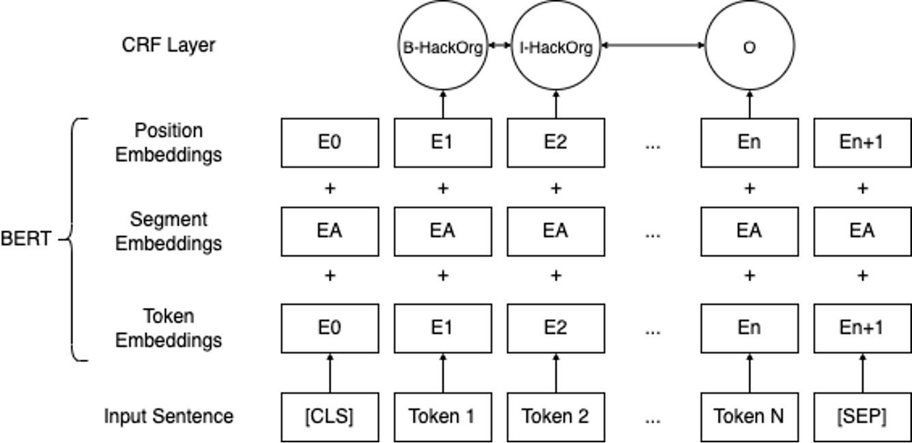
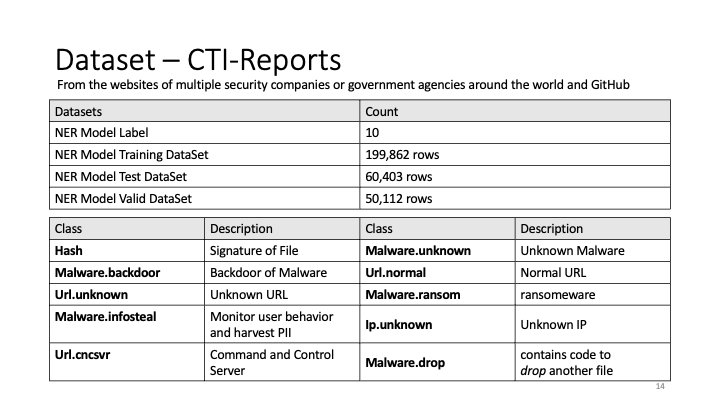
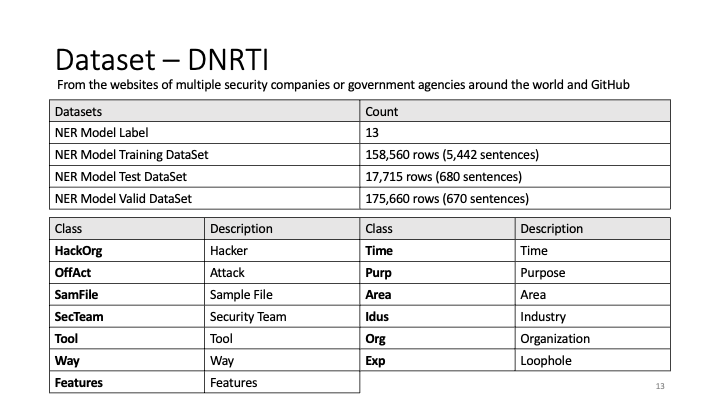
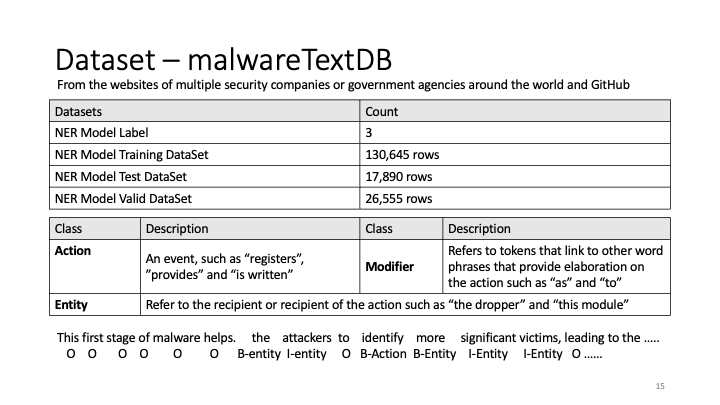
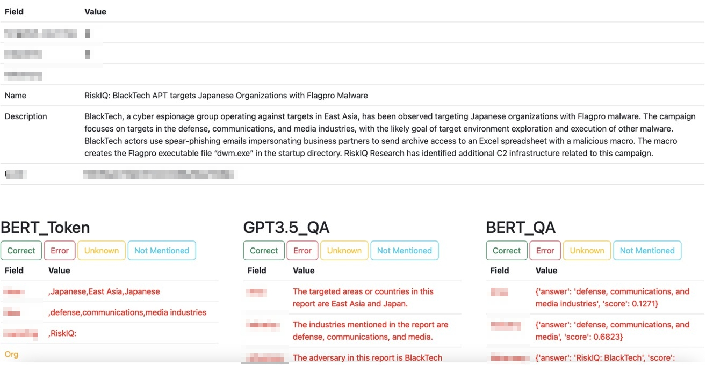

# Enhancing Cyber Threat Intelligence with Named Entity Recognition using BERT-CRF

This study introduces a unique model based on BERT, specially designed for the token classification task. It can extract specific threat-related information known as "named entities" from information security threats, with an impressive accuracy rate of over 90%. When compared to the popular GPT 3.5 in real-life situations, our model demonstrates superior performance.

## Model Structure 

Below is the structure of the folders and files used in the project:



## Folders Tree 

```
.
├── README.md
├── datasets
│   ├── CTI-reports
│   ├── DNRTI
│   ├── MalwareTextDB
│   └── conll2003
├── images
│   ├── model_structure.png
│   └── ppt
├── outputs
│   └── ner_bert_crf_checkpoint.pt
├── predict.py
├── requirements.txt
├── stopwords
│   ├── stopWord_summar.txt
│   ├── stopWord_test.txt
│   └── stopwords.txt
├── train.py
├── cloab_bert_crf.ipynb
└── website
    ├── README.md
    ├── app.py
    ├── requirements.txt
    ├── saved_dictionary3.pkl
    ├── static
    ├── templates
    └── test.ipynb

```
## Requirements

As of Thu Mar 30, 2023, the following are required:

Operating System: Ubuntu 20.04
### GPU
NVIDIA RTX A5000
NVIDIA-SMI: 515.86.01
Driver Version: 515.86.01
CUDA Version: 11.7
Python: 3.8
  

## How to use

### Step 1: Move All Folders to Desktop
If the name of the folder is "NER_BERT_OPEN_VERSION," move it to the Desktop:

```
mv NER_BERT_OPEN_VERSION ~/Desktop/
```

### Step 2: Install Anaconda

```
wget https://repo.anaconda.com/archive/Anaconda3-2022.05-Linux-x86_64.sh
bash Anaconda3-2022.05-Linux-x86_64.sh
```

### Step 3: Create a Virtual Environment and Activate it

```
conda create --name bert_env python=3.8
conda activate bert_env
```

### Step 4: Install Required Libraries

```
pip3 install -r requirements.txt
```

### Step 5: Train the Model 
```
python3 train.py
``` 
> Note: You can also skip this step and proceed to Step 6. If skipping, download the model from [Google Drive](https://drive.google.com/file/d/1iiPhrRbUNB8-85GjdqZeVe_iC7aI7gn_/view?usp=share_link), move it to the outputs folder, and ensure the model name remains unchanged. Check that the file hash is correct: MD5 (ner_bert_crf_checkpoint.pt) = 4faa7b6cd4a44cd8ac829611c0920b08.
### Step 6: Predict a Sentence

Use the following command to predict a sentence:

```
python3 predict.py -I "INPUT SENTENCE"
# or
python3 predict.py --input "INPUT SENTENCE"
```

#### Google Colab Version
You can directly run colab_bert_crf.ipynb:
```
git clone https://github.com/stwater20/ner_bert_crf_open_version.git
```

1. Upload all files to Google Drive.
2. Link your Drive space in Colab.
3. Run the code!
    > Recommendation: Use GPU to run the code.


## Datasets

1. [CTI-rerpots](https://github.com/nlpai-lab/CTI-reports-dataset)

    

2. [DNRTI](https://github.com/SCreaMxp/DNRTI-A-Large-scale-Dataset-for-Named-Entity-Recognition-in-Threat-Intelligence)

    

3. [MalwareTextDB](https://aclanthology.org/P17-1143/)

    

> Pre-processing has been performed on this dataset.


## Results

The performance of various models on different datasets is summarized below:


|                    | DNRTI  | CTI-reports | MalwareTextDB |
|--------------------|--------|------------|---------------|
| BERT_CRF           | 90.02% | 77.29%     | 58.57%        |
| secBERT_CRF        | 88.62% | 72.52%     | 62.53%        |
| BERT_BiLSTM_CRF    | 84.59% | 74.39%     | 45.59%        |
| secBERT_BiLSTM_CRF | 83.77% | 68.05%     | 47.07%        |

<br>


## Implementation

Here's a sample prediction:


Our model is also compared with other technologies, including [GPT-3.5](https://platform.openai.com/docs/models/gpt-3) and [DistilBERT base cased distilled SQuAD](https://www.google.com/search?client=safari&rls=en&q=distilbert-base-cased-distilled-squad&ie=UTF-8&oe=UTF-8).

<br>

## Evaluation

To gauge the model's real-world usability, we created a website for live comparison. Although dataset results don't always reflect real-world scenarios, we manually annotated and evaluated about 9000 OSINT records, confirming that our method outperforms others.

| Model   | Score  |
|---------|--------|
| BERT    | 82.64% |
| GPT     | 64.56% |
| BERT_QA | 36.68% |





