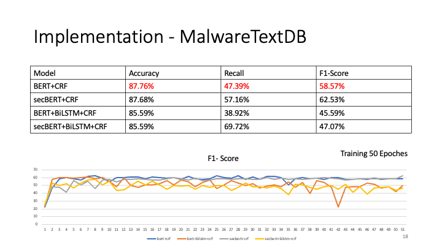

# Enhancing Cyber Threat Intelligence with Named Entity Recognition using BERT-CRF

This study proposes a novel BERT-based model for the fine-tune task of token classification, which can extract specific information security threat named entities for threat information, with an accuracy rate of more than 90%. In order to reflect the real environment, real information is used for comparison The online popular GPT 3.5, the results show that our model gets better results.


## Model Structure 


## Folders Tree 

```
.
├── README.md
├── datasets
│   ├── CTI-reports
│   ├── DNRTI
│   ├── MalwareTextDB
│   └── conll2003
├── images
│   ├── model_structure.png
│   └── ppt
├── outputs
│   └── ner_bert_crf_checkpoint.pt
├── predict.py
├── requirements.txt
├── stopwords
│   ├── stopWord_summar.txt
│   ├── stopWord_test.txt
│   └── stopwords.txt
├── train.py
├── cloab_bert_crf.ipynb
└── website
    ├── README.md
    ├── app.py
    ├── requirements.txt
    ├── saved_dictionary3.pkl
    ├── static
    ├── templates
    └── test.ipynb

```
## Requirements

Last Query: Thu Mar 30 11:38:17 2023     
* Ubuntu 20.04
* GPU
  * NVDIA RTX A5000
    * NVIDIA-SMI: 515.86.01
    * Driver Version: 515.86.01
    * CUDA Version: 11.7
* <b>Python: 3.8</b>
  

## How to use

1. Move all folders in to Desktop
    ```
    # if the name of the folder is "NER_BERT_OPEN_VERSION"
    mv NER_BERT_OPEN_VERSION ~/Desktop/
    ```
2. install anaconda

    ```
    wget https://repo.anaconda.com/archive/Anaconda3-2022.05-Linux-x86_64.sh
    bash Anaconda3-2022.05-Linux-x86_64.sh
    ```

3. create virtual enviroment and activate it
    ```
    conda create --name bert_env python=3.8
    conda activate bert_env
    ```
4. install dependency libaries
    ```
    pip3 install -r requirements.txt
    ```
5. train model
    ```
    python3 train.py
    ```
> You can also skip this step and go to the step 5. <br>
> If you skip this step, the model pkl is in [Google Drive](https://drive.google.com/file/d/1iiPhrRbUNB8-85GjdqZeVe_iC7aI7gn_/view?usp=share_link), please download it then move to outputs folder. And do not change the model name. <br>
>> Please check the file hash is correct.<br>
>> MD5 (ner_bert_crf_checkpoint.pt) = 4faa7b6cd4a44cd8ac829611c0920b08

6. predict one sentence
   
    ```
    python3 predict.py -I "INPUT SENTENCE"
    # or
    python3 preict.py --input "INPUT SENTENCE"
    ```

## Colab Ver.

Now, You can run the colab_bert_crf.ipynb directly.

```
git clone https://github.com/stwater20/ner_bert_crf_open_version.git
```

Then, upload all file to Google Drive.

In colab, link your drive space.

Last Run the code!

> Recommend you use GPT to run the code.


## Datasets

1. [CTI-rerpots](https://github.com/nlpai-lab/CTI-reports-dataset)

    

2. [DNRTI](https://github.com/SCreaMxp/DNRTI-A-Large-scale-Dataset-for-Named-Entity-Recognition-in-Threat-Intelligence)

    

3. [MalwareTextDB](https://aclanthology.org/P17-1143/)

    
    > I have done some pre-processing in this dataset.


## Results

|                    | DNRTI  | CTI-reports | MalwareTextDB |
|--------------------|--------|------------|---------------|
| CRF                | 80.00% |            |               |
| BERT_CRF           | 90.02% | 77.29%     | 58.57%        |
| secBERT_CRF        | 88.62% | 72.52%     | 62.53%        |
| BERT_BiLSTM_CRF    | 84.59% | 74.39%     | 45.59%        |
| secBERT_BiLSTM_CRF | 83.77% | 68.05%     | 47.07%        |

<br>

### All Datasets comapration


1. CTI_reports
   
    

2. DNRTI
   
    

3. MalwareTextDB
   
    

<br>

## Implementation

There is a predict sample.


And I also compare with other technology, includes the [GPT-3.5](https://platform.openai.com/docs/models/gpt-3) and [DistilBERT base cased distilled SQuAD](https://www.google.com/search?client=safari&rls=en&q=distilbert-base-cased-distilled-squad&ie=UTF-8&oe=UTF-8).

<br>

## Evaluation

In order to reflect the usability of the model in the real environment, we designed a website to compare the real situation.


The results of the dataset sometimes do not reflect the natural environment, so we collected about 9000 OSINT records in the natural environment for manual annotation and evaluation. We can see that our method achieves better results.

### Average Score:
* BERT: 82.64%
* GPT: 64.56%
* BERT_QA: 36.68%


